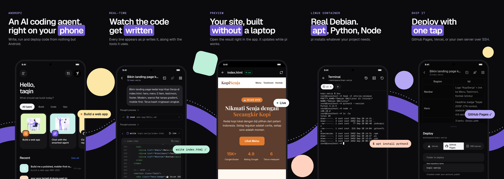

<p align="center">
  
</p>

<h1 align="center">AndroPI</h1>

<p align="center">An AI coding agent that runs on your Android phone.<br>
Write, run, preview and deploy code without a laptop.</p>

<p align="center">
  
</p>

AndroPI puts the [pi coding agent](https://github.com/earendil-works/pi) on Android. The agent runs locally in a
bundled Node.js runtime. It reads and writes files, runs shell commands in a real Debian or Alpine container,
searches the web, and ships your project to GitHub Pages, Vercel or your own server. You bring the model:
Anthropic, OpenAI, Gemini, OpenRouter and the other providers pi supports.

## Features

- **Chat with a coding agent.** Replies stream in real time, with code blocks, tool calls and a live HTML
  preview that updates while the agent writes the page.
- **Linux container.** Debian or Alpine through proot, so `apt`, `pip` and `npm` work. It is on by default and is
  the agent's shell.
- **Projects.** Each chat can use its own folder, or you can open any folder on the phone. The app includes a file
  explorer, a code editor, project search, a diff view and a checkpoint/undo for every agent run.
- **Git and GitHub.** Sign in with GitHub's device code, then clone repositories, commit, push, pick branches,
  turn issues into pull requests and follow GitHub Actions runs.
- **Deploy.** GitHub Pages, Vercel, or SSH/rsync to your own servers. Dev servers can be shared with a public tunnel.
- **Terminal.** Multi-tab terminal with SSH to saved servers.
- **Agent controls.**
  - Approval modes: ask for everything, ask for risky actions only, or bypass all approvals.
  - Plan mode, message queue, and fork or edit-and-resend on any message.
  - Background tasks and schedules.
  - MCP servers, skills (with a searchable skills catalogue), prompt templates and slash commands.
- **Everyday use.**
  - Image and file attachments, and voice input.
  - Share to AndroPI from other apps; home screen widget and Quick Settings tile.
  - Notifications.
  - Usage and cost tracking with a daily budget, and automatic fallback to another model.
  - App lock, encrypted tokens, and backup and restore.
  - Themes and accents, English and Bahasa Indonesia.
- **Web search that survives DNS blocking.** DNS-over-HTTPS for the agent's network access.

## Build

Requirements: Flutter (stable), Node.js 20+, Python 3 with `lief` (`pip install lief`), the Android SDK/NDK, and an
arm64 Android device.

```bash
# 1. Native runtime: node, git, ssh, rsync, curl, proot, ... from the Termux repository, repackaged as jniLibs
python tool/bundle_runtime.py

# 2. The agent host (TypeScript), bundled into android/app/src/main/assets/agent.zip
cd agent && npm install && node build.mjs && cd ..

# 3. The app
flutter pub get
flutter build apk --release
```

Steps 1 and 2 generate files that are not in the repository (`jniLibs/`, `agent.zip`). Run them again after you
change `tool/` or `agent/`.

## Layout

| Path | What it is |
| --- | --- |
| `lib/` | Flutter app (UI in `lib/ui`, agent client in `lib/agent`) |
| `agent/src/` | Node host that runs pi and talks to the app over JSON lines |
| `agent/skills/` | Skills bundled with the app |
| `android/` | Kotlin side: runtime extraction, foreground service, share targets, widget, tile |
| `tool/` | Runtime bundler and the `box` container launcher |
| `store/` | Play Store assets (English and Indonesian) |

## Credits

- [pi](https://github.com/earendil-works/pi): the coding agent (MIT)
- [Termux packages](https://github.com/termux/termux-packages): the Android builds of Node.js, git, OpenSSH, proot
  and other tools bundled at build time, each under its own license
- [Storyset](https://storyset.com): illustrations
- [Lucide](https://lucide.dev) and [Simple Icons](https://simpleicons.org): icons
- [Geist](https://vercel.com/font): fonts (OFL)

## License

[MIT](LICENSE) © imtaqin ([@fdciabdul](https://github.com/fdciabdul))
